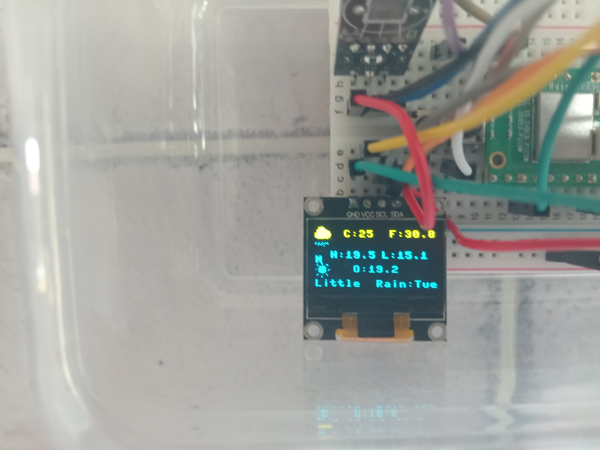
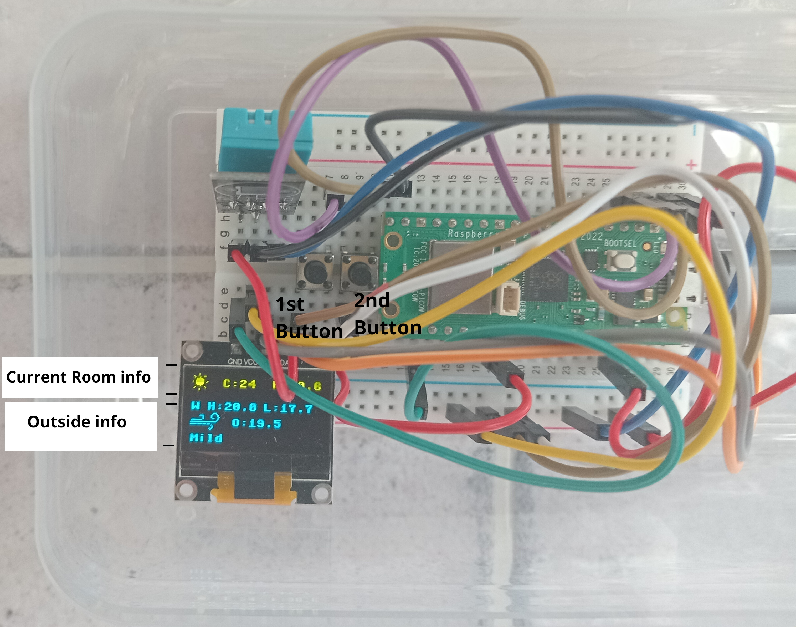
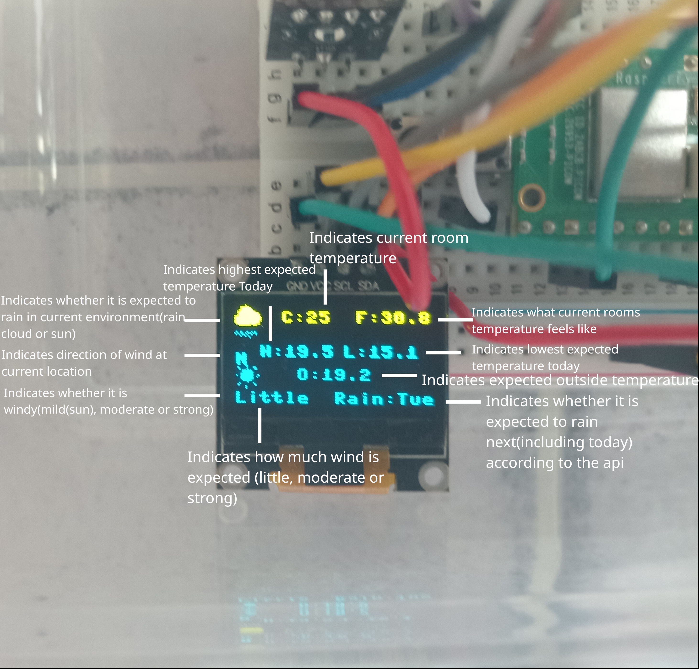
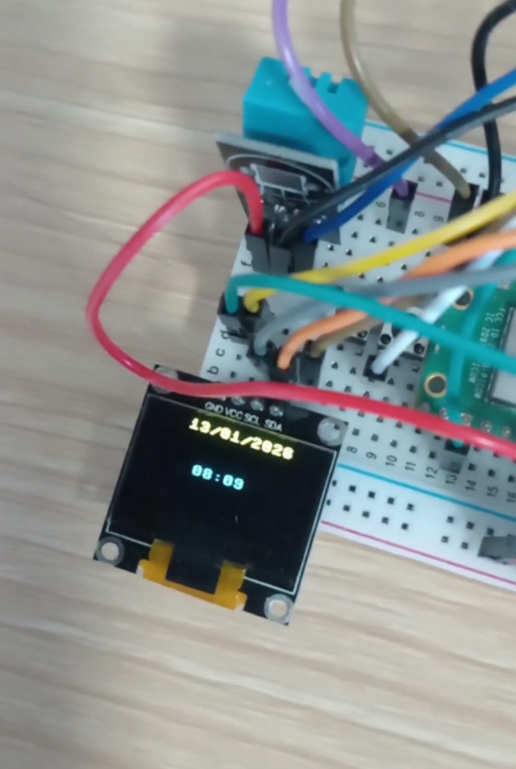

# **Overview of Main Projects I have completed**

## *Dual-mode Weather station*

The dual mode weather station that I developed takes both measurements for the current conditions in the room, as well as it uses a free and open source online API(Open-mateo API) to retrieve measurements for current location, and is able to retrieve information about what the current time and date is through again communicating with an online API being World Time API. 

To give the user options over the desired information being indicated on screen, there are two seperate buttons, as labelled in image, button one and button two. When the device is connected to power, the device automatically connects to wifi and displays weather information as shown in the image below.

  
  

  

Button 1
: When device has just turned on, by pressing button 1, it will switch from showing the weather to showing the current time and data, if pressed again from here, it will then switch back to weather and vice versa.

Button 2
: When button 2 is pressed it will either turn the display on and off, it has the additional function of restarting the device if need be

  

--- 

## *Advanced Tic Tac Toe Game*
