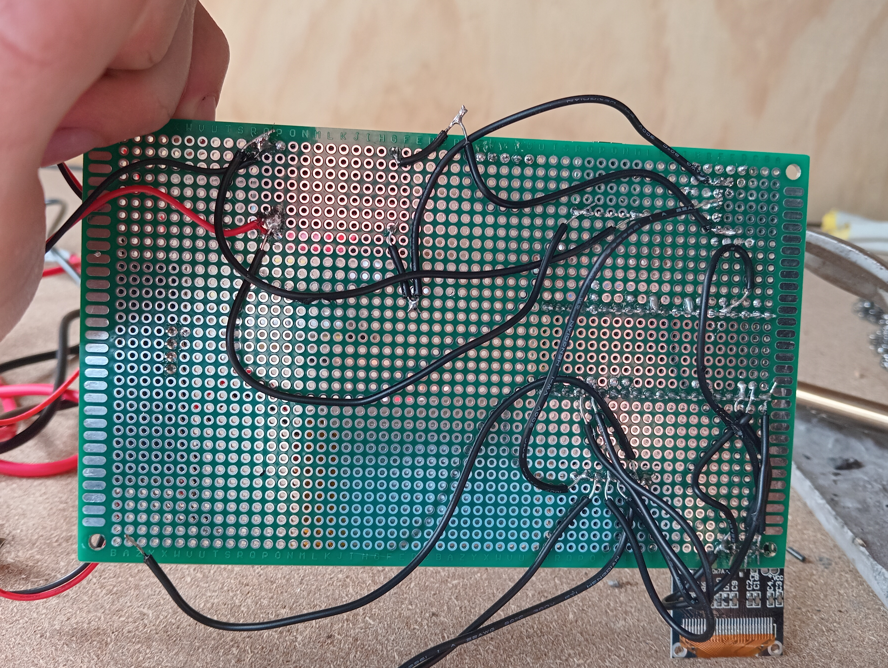
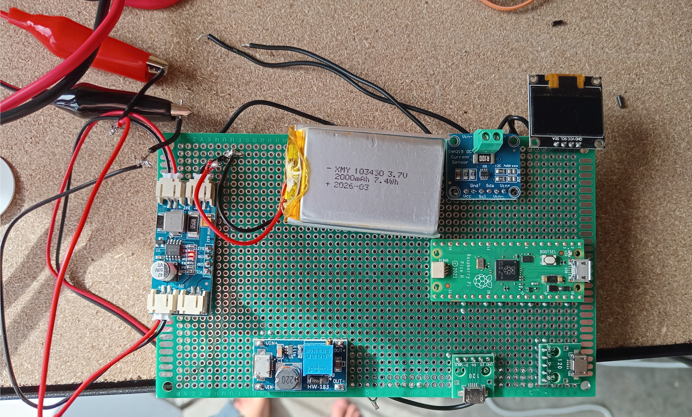
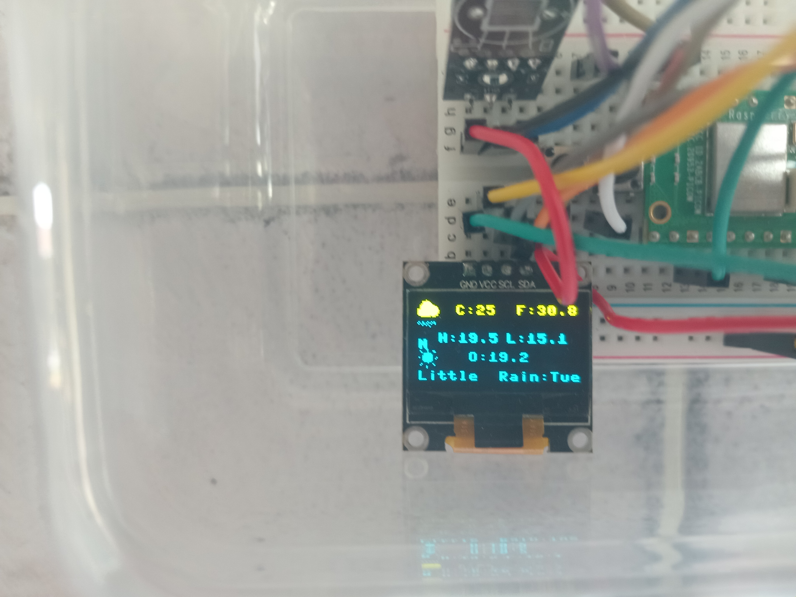
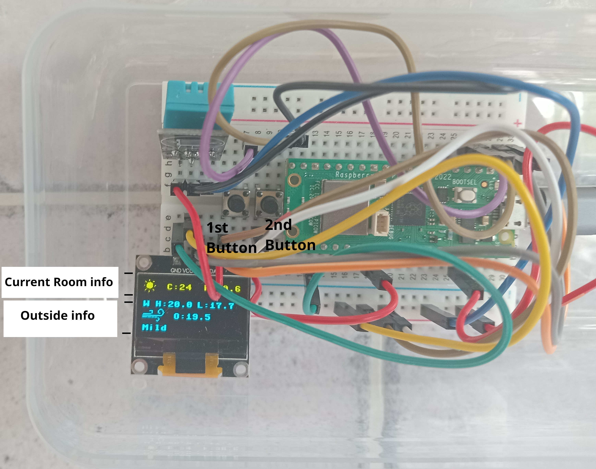
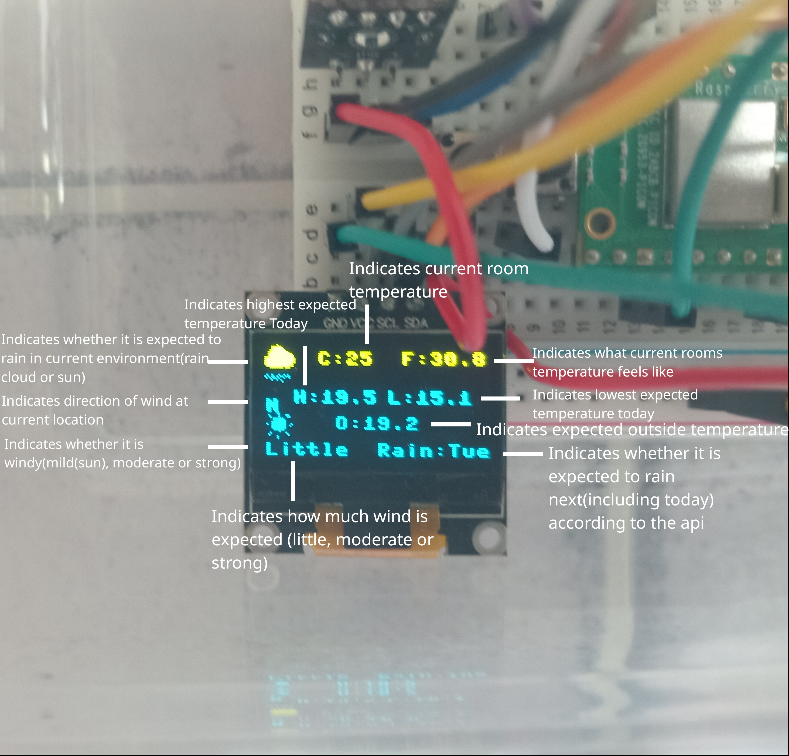
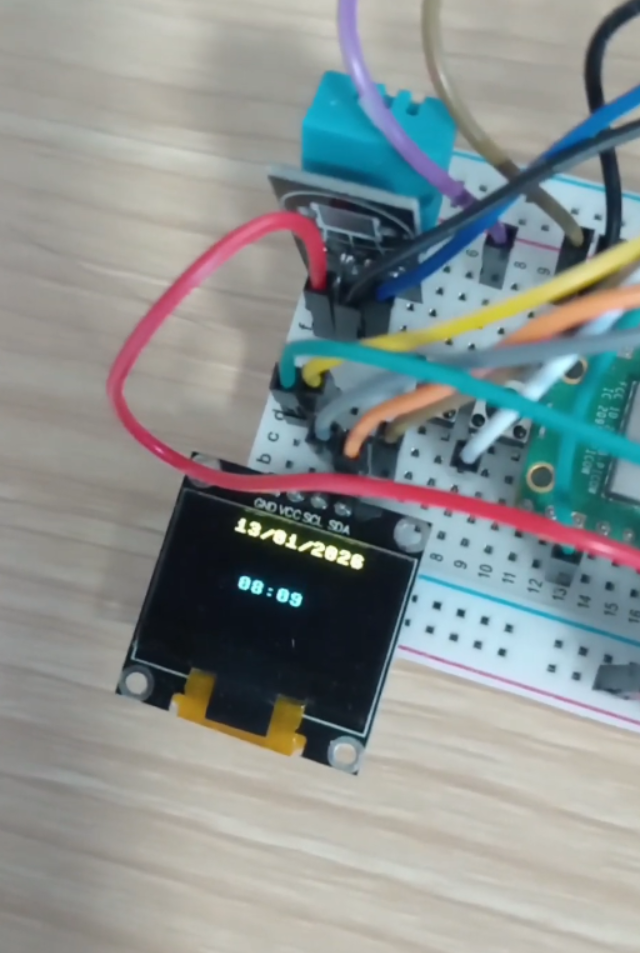
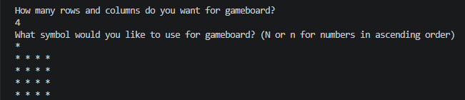
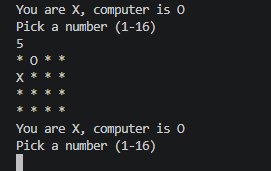

## *Note, currently in process of investigating making variable power supply *

# **Overview of Main Projects I have completed**

<strong>MPPT Solar Panel USB Charger</strong>

## *MPPT Solar Panel USB Charger*

### Introduction
In this modern day and age, everyone wants an energy sector made primarily of renewable energy. Not only is renewable energy more environmentally friendly, it also makes sense from an economic standpoint, as indicated by the recent Iran War Fuel Crisis. This conflict, reminded New Zealand of the importance of having a nationalistic and independent approach to renewable energy. It reminded us of the negative negative effects of being reliant on foreign countries to produce our necessary energy needs, and how a conflict on the opposite side of the world can have a substantial impact on our economy.

Which is the reason behind making an MPPT solar panel USB charger for myself. This device enables me to be able to access renewable energy on the fly wherever I am. This is useful for me since I enjoy doing talks in the Tararua Range, and so having a small compact device that allows me to get free, clean energy is extremerly useful, since it avoids the use of having to carry around a battery pack, which slowly uses charge the more I use it, until it is next charged.

Furthermore, by being MPPT (maximum power point tracking), it means that I am maximizing the power output from the solar panel. This is important in renewable systems, since if we have a solar panel farm, we want to be able to maximise the power we are getting from these solar panels, hence we wish to maximise power to do so, hence the advantage of using MPPT.
However, lots of devices need to have a constant stable output voltage, one that is not MPPT, such as phones which require a constant stable 5V output, hence this will also be a feature of my MPPT solar panel USB charger.

### Components Used

- 1 x MT3608 - Step Up DC-DC Boost Convertor
- 1 x INA219 - Current, voltage and power measuring sensor
- 1 x CN3791 - MPPT Solar Panel Charge Controller
- 1 x Solar Panel - 5W, 12V 
- 1 x LiPo Battery - 103450 3.7V 2000mAh with inbuilt short circuit and overcharge protection
- 3 x Breakout Pins to USB Micro Module
- 1 x Raspberry Pico
- 1 x OLED Display

  

Note in reality there are only 2 USB micro modules not 3, this is due to only having one micro usb to USB A convertor.

### Stage One of Development

Stage one of development includes setting up the MPPT Solar panel controller, and attaching it to the MT3608 step up voltage module and then having two usb output devices. 
Please ignore the Pico and OLED display in the images below.

  
  

<strong>Dual-mode Weather station</strong>

## *Dual-mode Weather station*

The dual mode weather station that I developed takes both measurements for the current conditions in the room, as well as it uses a free and open source online API(Open-mateo API) to retrieve measurements for current location, and is able to retrieve information about what the current time and date is through again communicating with an online API being World Time API. 

To give the user options over the desired information being indicated on screen, there are two seperate buttons, as labelled in image, button one and button two. When the device is connected to power, the device automatically connects to wifi and displays weather information as shown in the image below.

  
  

  

Button 1
: When device has just turned on, by pressing button 1, it will switch from showing the weather to showing the current time and data, if pressed again from here, it will then switch back to weather and vice versa.

Button 2
: When button 2 is pressed it will either turn the display on and off, it has the additional function of restarting the device if need be

  

---

<strong>Advanced TIc Tac Toe Game</strong>

## *Dual-mode Weather station*

The purpose of this game was to make me more fluent in C++. 
This is a more advanced take on the more regular tic tac toe game. It is advanced because of the different user inputs which changes the parameters of the end game. As follows.

  

The user is initially greeted with the following message from the program.

  
  

The first parameter that the user has choice on, is the size of the gameboard, as shown above. Thus by entering the number 4, a 4x4 grid is generated. The same rules for conventional 3x3 tic tac toe still apply.

Furthermore, the user is also able to enter the character they wish to be displayed for empty spaces.

As shown to the right, if the character entered is 'N' or 'n' then the positional numbers is printed to the screen.

  

The user then has to enter the position for their move, eg in the above example, entering number five, the user makes a move at space 5.
The computer then picks a random number, and makes their move at thus random number they chose.

  

Thus the game continues as conventional tic tac toe, until either the player or the computer wins.

---

